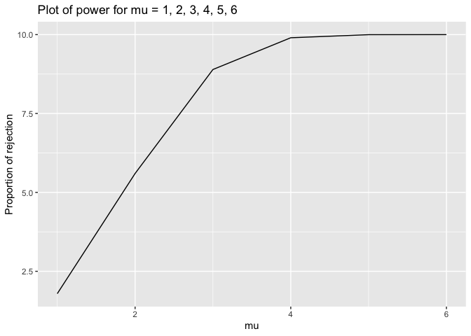

P8105
================
Jiawen Zhao
11/3/2022

#### Problem 1

    ## Rows: 1 Columns: 8
    ## ── Column specification ────────────────────────────────────────────────────────
    ## Delimiter: ","
    ## dbl (8): week_1, week_2, week_3, week_4, week_5, week_6, week_7, week_8
    ## 
    ## ℹ Use `spec()` to retrieve the full column specification for this data.
    ## ℹ Specify the column types or set `show_col_types = FALSE` to quiet this message.
    ## Rows: 1 Columns: 8
    ## ── Column specification ────────────────────────────────────────────────────────
    ## Delimiter: ","
    ## dbl (8): week_1, week_2, week_3, week_4, week_5, week_6, week_7, week_8
    ## 
    ## ℹ Use `spec()` to retrieve the full column specification for this data.
    ## ℹ Specify the column types or set `show_col_types = FALSE` to quiet this message.
    ## Rows: 1 Columns: 8
    ## ── Column specification ────────────────────────────────────────────────────────
    ## Delimiter: ","
    ## dbl (8): week_1, week_2, week_3, week_4, week_5, week_6, week_7, week_8
    ## 
    ## ℹ Use `spec()` to retrieve the full column specification for this data.
    ## ℹ Specify the column types or set `show_col_types = FALSE` to quiet this message.
    ## Rows: 1 Columns: 8
    ## ── Column specification ────────────────────────────────────────────────────────
    ## Delimiter: ","
    ## dbl (8): week_1, week_2, week_3, week_4, week_5, week_6, week_7, week_8
    ## 
    ## ℹ Use `spec()` to retrieve the full column specification for this data.
    ## ℹ Specify the column types or set `show_col_types = FALSE` to quiet this message.
    ## Rows: 1 Columns: 8
    ## ── Column specification ────────────────────────────────────────────────────────
    ## Delimiter: ","
    ## dbl (8): week_1, week_2, week_3, week_4, week_5, week_6, week_7, week_8
    ## 
    ## ℹ Use `spec()` to retrieve the full column specification for this data.
    ## ℹ Specify the column types or set `show_col_types = FALSE` to quiet this message.
    ## Rows: 1 Columns: 8
    ## ── Column specification ────────────────────────────────────────────────────────
    ## Delimiter: ","
    ## dbl (8): week_1, week_2, week_3, week_4, week_5, week_6, week_7, week_8
    ## 
    ## ℹ Use `spec()` to retrieve the full column specification for this data.
    ## ℹ Specify the column types or set `show_col_types = FALSE` to quiet this message.
    ## Rows: 1 Columns: 8
    ## ── Column specification ────────────────────────────────────────────────────────
    ## Delimiter: ","
    ## dbl (8): week_1, week_2, week_3, week_4, week_5, week_6, week_7, week_8
    ## 
    ## ℹ Use `spec()` to retrieve the full column specification for this data.
    ## ℹ Specify the column types or set `show_col_types = FALSE` to quiet this message.
    ## Rows: 1 Columns: 8
    ## ── Column specification ────────────────────────────────────────────────────────
    ## Delimiter: ","
    ## dbl (8): week_1, week_2, week_3, week_4, week_5, week_6, week_7, week_8
    ## 
    ## ℹ Use `spec()` to retrieve the full column specification for this data.
    ## ℹ Specify the column types or set `show_col_types = FALSE` to quiet this message.
    ## Rows: 1 Columns: 8
    ## ── Column specification ────────────────────────────────────────────────────────
    ## Delimiter: ","
    ## dbl (8): week_1, week_2, week_3, week_4, week_5, week_6, week_7, week_8
    ## 
    ## ℹ Use `spec()` to retrieve the full column specification for this data.
    ## ℹ Specify the column types or set `show_col_types = FALSE` to quiet this message.
    ## Rows: 1 Columns: 8
    ## ── Column specification ────────────────────────────────────────────────────────
    ## Delimiter: ","
    ## dbl (8): week_1, week_2, week_3, week_4, week_5, week_6, week_7, week_8
    ## 
    ## ℹ Use `spec()` to retrieve the full column specification for this data.
    ## ℹ Specify the column types or set `show_col_types = FALSE` to quiet this message.
    ## Rows: 1 Columns: 8
    ## ── Column specification ────────────────────────────────────────────────────────
    ## Delimiter: ","
    ## dbl (8): week_1, week_2, week_3, week_4, week_5, week_6, week_7, week_8
    ## 
    ## ℹ Use `spec()` to retrieve the full column specification for this data.
    ## ℹ Specify the column types or set `show_col_types = FALSE` to quiet this message.
    ## Rows: 1 Columns: 8
    ## ── Column specification ────────────────────────────────────────────────────────
    ## Delimiter: ","
    ## dbl (8): week_1, week_2, week_3, week_4, week_5, week_6, week_7, week_8
    ## 
    ## ℹ Use `spec()` to retrieve the full column specification for this data.
    ## ℹ Specify the column types or set `show_col_types = FALSE` to quiet this message.
    ## Rows: 1 Columns: 8
    ## ── Column specification ────────────────────────────────────────────────────────
    ## Delimiter: ","
    ## dbl (8): week_1, week_2, week_3, week_4, week_5, week_6, week_7, week_8
    ## 
    ## ℹ Use `spec()` to retrieve the full column specification for this data.
    ## ℹ Specify the column types or set `show_col_types = FALSE` to quiet this message.
    ## Rows: 1 Columns: 8
    ## ── Column specification ────────────────────────────────────────────────────────
    ## Delimiter: ","
    ## dbl (8): week_1, week_2, week_3, week_4, week_5, week_6, week_7, week_8
    ## 
    ## ℹ Use `spec()` to retrieve the full column specification for this data.
    ## ℹ Specify the column types or set `show_col_types = FALSE` to quiet this message.
    ## Rows: 1 Columns: 8
    ## ── Column specification ────────────────────────────────────────────────────────
    ## Delimiter: ","
    ## dbl (8): week_1, week_2, week_3, week_4, week_5, week_6, week_7, week_8
    ## 
    ## ℹ Use `spec()` to retrieve the full column specification for this data.
    ## ℹ Specify the column types or set `show_col_types = FALSE` to quiet this message.
    ## Rows: 1 Columns: 8
    ## ── Column specification ────────────────────────────────────────────────────────
    ## Delimiter: ","
    ## dbl (8): week_1, week_2, week_3, week_4, week_5, week_6, week_7, week_8
    ## 
    ## ℹ Use `spec()` to retrieve the full column specification for this data.
    ## ℹ Specify the column types or set `show_col_types = FALSE` to quiet this message.
    ## Rows: 1 Columns: 8
    ## ── Column specification ────────────────────────────────────────────────────────
    ## Delimiter: ","
    ## dbl (8): week_1, week_2, week_3, week_4, week_5, week_6, week_7, week_8
    ## 
    ## ℹ Use `spec()` to retrieve the full column specification for this data.
    ## ℹ Specify the column types or set `show_col_types = FALSE` to quiet this message.
    ## Rows: 1 Columns: 8
    ## ── Column specification ────────────────────────────────────────────────────────
    ## Delimiter: ","
    ## dbl (8): week_1, week_2, week_3, week_4, week_5, week_6, week_7, week_8
    ## 
    ## ℹ Use `spec()` to retrieve the full column specification for this data.
    ## ℹ Specify the column types or set `show_col_types = FALSE` to quiet this message.
    ## Rows: 1 Columns: 8
    ## ── Column specification ────────────────────────────────────────────────────────
    ## Delimiter: ","
    ## dbl (8): week_1, week_2, week_3, week_4, week_5, week_6, week_7, week_8
    ## 
    ## ℹ Use `spec()` to retrieve the full column specification for this data.
    ## ℹ Specify the column types or set `show_col_types = FALSE` to quiet this message.
    ## Rows: 1 Columns: 8
    ## ── Column specification ────────────────────────────────────────────────────────
    ## Delimiter: ","
    ## dbl (8): week_1, week_2, week_3, week_4, week_5, week_6, week_7, week_8
    ## 
    ## ℹ Use `spec()` to retrieve the full column specification for this data.
    ## ℹ Specify the column types or set `show_col_types = FALSE` to quiet this message.

    ## Warning: `cols` is now required when using unnest().
    ## Please use `cols = c(data)`

``` r
tidy_df = 
  full_df %>% 
  mutate(
    files = str_replace(files, ".csv", ""),
    group = str_sub(files, 1, 3)) %>% 
  pivot_longer(
    week_1:week_8,
    names_to = "week",
    values_to = "outcome",
    names_prefix = "week_") %>% 
  mutate(week = as.numeric(week)) %>% 
  select(group, subj = files, week, outcome)
```

``` r
tidy_df %>% 
  ggplot(aes(x = week, y = outcome, group = subj, color = group)) + 
  geom_point() + 
  geom_path() + 
  facet_grid(~group)
```

<!-- -->

This plot suggests high within-subject correlation – subjects who start
above average end up above average, and those that start below average
end up below average. Subjects in the control group generally don’t
change over time, but those in the experiment group increase their
outcome in a roughly linear way.

#### Problem 2

``` r
homicide <- read.csv("./data/homicide-data.csv")%>% 
  na.omit() %>% 
  unite(city_state, c(city,state),sep = ", ") %>% 
  mutate(solved = case_when(grepl("Closed by arrest", disposition)==TRUE ~ 1,
  grepl("Closed by arrest", disposition)==FALSE ~ 0)) %>% 
  mutate(unsolved = case_when(grepl("Closed by arrest", disposition)==FALSE ~ 1,
  grepl("Closed by arrest", disposition)==TRUE ~ 0)) 
homicide_summary = group_by(homicide,city_state) %>% 
  summarise(total_solved = sum(solved),
            total_unsolved = sum(unsolved))
BMD = filter(homicide_summary,city_state=="Baltimore, MD")
result = prop.test(BMD$total_unsolved, BMD$total_solved+BMD$total_unsolved)
broom::tidy(result)%>%
  select(estimate, conf.low,conf.high)
```

    ## # A tibble: 1 × 3
    ##   estimate conf.low conf.high
    ##      <dbl>    <dbl>     <dbl>
    ## 1    0.646    0.628     0.663

By the result above, we see that on average 64.6% of crimes of
Baltimore,MD are not solved. The 95% Confidence Interval is \[62.8%,
66.3%\].

``` r
prop_test_results = function(x,n) {
  result = prop.test(x, n)
  broom::tidy(result)
}


sim_results_df = 
  homicide_summary %>% 
  mutate(
    estimate_df = 
      map2(.x = total_unsolved, .y = total_solved+total_unsolved, ~prop_test_results(x = .x, n = .y))
  ) %>% 
  unnest(estimate_df)
```

    ## Warning in prop.test(x, n): Chi-squared approximation may be incorrect

``` r
sim_results_df %>% 
  mutate(
    city_state = fct_reorder(city_state, -estimate)
  ) %>%
  ggplot(aes(x = city_state, y = estimate)) + 
  geom_errorbar(aes(ymin = conf.low, ymax = conf.high), width = 0.2)+
  scale_x_discrete(guide = guide_axis(angle = 90))+
  geom_point()
```

<!-- -->

From the plot, we can see that Chicago,IL has the highest proportion of
unsolved crimes, and Tulsa, AL has the lowest proportion of unsolved
crimes, since it has only one crime and it’s solved.

# Problem 3

``` r
sim_mean_sd = function(n = 30, mu, sigma = 5) {
  
  sim_data = tibble(
    x = rnorm(n, mean = mu, sd = sigma),
  )
  result = t.test(sim_data$x)
  result = broom::tidy(result)
  sim_data %>% 
    summarize(
      mu_hat = mean(x),
      p_value = result$p.value
    )
}
output = vector("list", 5000)

t = tibble(mu = c(1,2,3,4,5,6))%>%
  mutate(count = c(5000)) %>%
  uncount(count)%>% 
  mutate(estimate_df = map(.x = mu, ~sim_mean_sd(mu = .x))) %>% 
  unnest(estimate_df) %>% 
  mutate(reject = case_when(p_value <= 0.05 ~ 1,
  p_value > 0.05 ~ 0)) 
tp = t %>% group_by(mu) %>% 
  summarise(power = sum(reject)/500)%>% 
  ggplot(aes(x = mu, y = power))+ 
  #geom_bar(stat="identity")
  geom_line() +
  ylab("Proportion of rejection") +
  labs(title = "Percentage of Rejection for mu")

tp
```

<!-- -->

The power increases very quickly for mu = 1, 2, 3, when the power = 4,
5, 6, the power is very high, over 95% , so it increases slower, and get
closer and closer to 100%.

``` r
reject_t = t%>%
  filter(reject == 1) %>% 
  group_by(mu) %>% 
  summarise(mean = mean(mu_hat))

t_all = t%>%
  group_by(mu) %>% 
  summarise(mean = mean(mu_hat))

plot1 = t_all%>% 
  ggplot(aes(x = mu, y = mean))+
  geom_line() +
  geom_point()+
  ylab("mean of estimated mu") +
  labs(title = "plot of mean of estimated mu and mu \nfor all samples")


plot2 = reject_t%>% 
  ggplot(aes(x = mu, y = mean))+
  geom_line() +
  geom_point()+
  ylab("mean of estimated mu") +
  labs(title = "plot of mean of estimated mu and mu \nfor rejected samples")
  

grid.arrange(plot1, plot2, ncol=2)
```

<!-- -->

No, their means are not the same. For the plot of all samples, we see
that the mean of estimated mu are about the same as the true mu, but for
the plot of rejected samples, the mean of estimated mu are higher than
the true mu at first (for mu = 1, 2, 3, 4), then the mean of estimated
mu gets closer to the true mu just like the plot for all samples.
